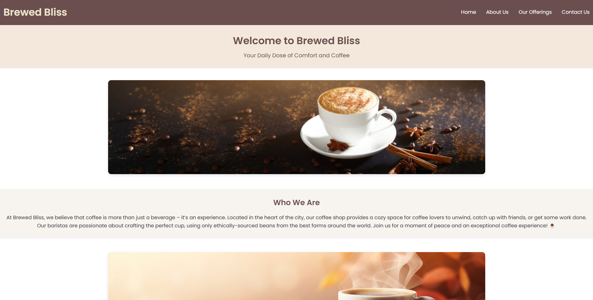
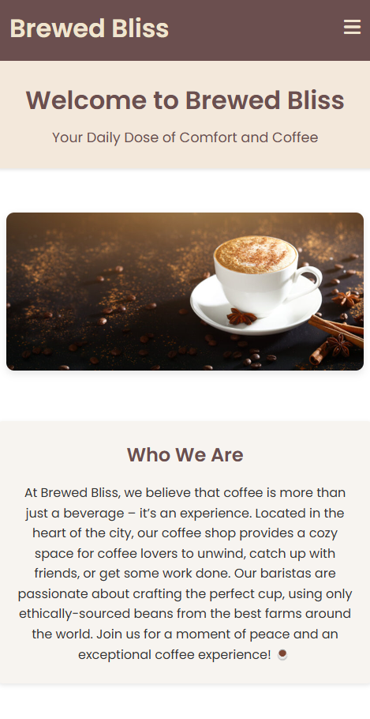

# Brewed Bliss Coffee Website ☕

## Project Overview

This project, titled **Brewed Bliss Coffee**, is the final project for the **COMP-126** class at **University of North Carolina at Chapel Hill** under the instruction of **Professor Tessa Joseph-Nicholas**. It is a comprehensive, fully-responsive website designed for a soon-to-open coffee shop, Brewed Bliss, located in Chapel Hill, NC. The website aims to provide an engaging and immersive experience for ALL users, including both customers and potential business partners.

## Project Objectives

The purpose of this project is to apply client-driven web development principles, as taught in COMP-126, to build a multi-page website that meets the needs of a business client (in this case, Brewed Bliss - a soon-to-open coffee shop in Chapel Hill, NC). The project follows best practices in HTML, CSS, and JS to create a responsive, accessible, and aesthetically pleasing user experience.

All requirements are ensured to be met, including mobile-first design, responsive layout, accessibility considerations, and a focus on user experience. This website is also carefully designed to be engaging, informative, and visually appealing to all users, regardless of their device or accessibility needs!

### Status

The project is currently complete, as of 11/27/2024.

### Live Website

The website is hosted on GitHub Pages and can be accessed [here](https://hoangsonww.github.io/Brewed-Bliss-Coffee-Website/).

## User Interface

### Desktop View

<p align="center">
  
</p>

### Mobile View

<p align="center">
  
</p>

## File Structure

```
root/
├── index.html                # Home Page
├── about.html                # About Us Page
├── services.html             # Our Offerings Page
├── contact.html              # Contact Us Page
├── README.md                 # Project Overview and Documentation
├── css/
│   └── styles.css            # Main CSS file for styling
├── js/
│   └── script.js             # JavaScript file for dynamic elements
├── img/
│   ├── favicon.ico           # Favicon
│   ├── intro-image.jpg       # Hero image for the home page
│   ├── gallery1.jpg          # Gallery images
│   ├── gallery2.jpg
│   ├── gallery3.jpg
│   └── ...                   # Additional images
└── manifest.json             # Web app manifest for PWA functionality
```

## Accessibility Considerations

- **Alt Text on All Images**: Each image includes alt text for visually impaired users.
- **Color Contrast**: Colors were chosen to meet WCAG standards (with all colors meeting at least the AA requirement) for contrast to ensure their readability.
- **Keyboard Accessibility**: All navigation and interactive elements can be accessed via keyboard input as well.

## A Note on Images

- All images used in this project are sourced from [Unsplash](https://unsplash.com/), [Adobe Stock](https://stock.adobe.com/), and [Pexels](https://www.pexels.com/).
- They are all licensed for free use and modification without attribution.

## Author

- [Son (David) Nguyen](https://github.com/hoangsonww), created as the final project for COMP-126 at UNC-Chapel Hill, Fall 2024.

---

Thank you for reviewing this project! We hope this website demonstrates the skills and principles learned in COMP-126 and provides a comprehensive, engaging experience for anyone visiting the **Brewed Bliss Coffee** shop online! ☕
